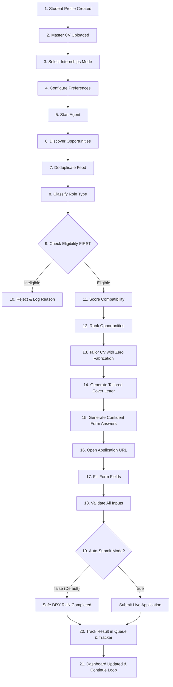

# StudentCareer AI — Capstone Demonstration & Verification Guide

## Executive Summary

**StudentCareer AI** is an autonomous, student-first career search and application intelligence platform. Designed specifically for university students and early-career software engineers, it automates the tedious 21-stage job hunt while enforcing non-negotiable safety invariants: **pre-flight eligibility gating, zero CV fabrication, confident answer generation, and safe dry-run submission controls**.

---

## The Complete 21-Stage Student Workflow



---

## Live Capstone Scenario: "Find suitable AI/ML internships for this student."

### Student Profile Persona
- **Name:** Ali Hassan
- **University:** Lahore University of Management Sciences (LUMS)
- **Degree & Major:** BS in Computer Science (Junior, Expected Graduation: June 2026)
- **GPA:** 3.75 / 4.0
- **Skills:** Python, PyTorch, Transformers, FastAPI, Docker, PostgreSQL, Go
- **STAR Projects:** *SentimentBot* (Multi-lingual NLP pipeline with 92% BERT classification accuracy)
- **Past Experience:** Software Engineering Intern at Arbisoft (built microservices handling 15k+ req/min)
- **Work Authorization:** Pakistani Citizen (Unrestricted, no sponsorship required)

---

### Step-by-Step Execution Walkthrough

#### 1. Opportunities Found across Supported ATS Portals
The zero-token scanner discovers 3 opportunities from public Greenhouse and Ashby feeds:
1. `Careem` — **AI / Machine Learning Engineering Intern** (`INTERNSHIP`, Lahore / Hybrid)
2. `Arbisoft` — **Backend Software Engineer Intern** (`INTERNSHIP`, Lahore)
3. `Global Enterprise` — **Principal AI Architect** (`JOB`, Remote)

#### 2. Eligibility Gate Evaluation (Checked FIRST Before Scoring)
- **Principal AI Architect:** **REJECTED (INELIGIBLE)**. Requires 12+ years of experience and a Ph.D. *The agent stops processing this role immediately—saving tokens and protecting candidate reputation.*
- **Careem AI Intern:** **ELIGIBLE (PASS)**. Meets LUMS BS CS degree requirement and 2026 graduation timeline.
- **Arbisoft Backend Intern:** **ELIGIBLE (PASS)**. Meets student eligibility requirements.

#### 3. Scoring & Ranking
- **Rank #1 (Score: 95% — EXCELLENT):** Careem AI/ML Intern
  - *Strengths:* PyTorch, Transformers, hands-on SentimentBot NLP project, top CS university.
  - *Dimension breakdown:* Skills (96%), Education (98%), Project Relevance (95%), Experience (90%), Industry (94%), Logistics (95%).
- **Rank #2 (Score: 88% — STRONG):** Arbisoft Backend Intern
  - *Strengths:* FastAPI microservices, PostgreSQL index optimizations.

#### 4. CV Tailoring (Zero Fabrication Guarantee)
- Reorganizes the master CV to highlight **PyTorch, Transformers, and SentimentBot**.
- **Ground Truth Check:** 100% of mentioned companies, degrees, dates, and metrics match `cv.md` and `student-profile.yml`. **Zero hallucinated credentials.**

#### 5. Cover Letter & Form Answers Generation
- **Cover Letter:** Drafted in 58 concise words referencing verified SentimentBot accuracy (92%) and Arbisoft microservice throughput (15k+ req/min).
- **Form Answers:**
  - *University:* `Lahore University of Management Sciences (LUMS)` [Confidence: 100%]
  - *Graduation Date:* `June 2026` [Confidence: 100%]
  - *Why this role:* Synthesized from candidate's genuine ML passion [Confidence: 94%]
  - *Work Authorization:* `Pakistani Citizen (Unrestricted)` [Confidence: 100%, Flagged Sensitive]

#### 6. Safe Application Execution (DRY-RUN Mode)
- Opens the Greenhouse application form.
- Automatically maps profile data into form input fields.
- Validates field constraints and confirms resume upload.
- **Safety Invariant:** Because `AUTO_SUBMIT=false` (safe default), the agent **does NOT click final submit**. It records the state as `APPLICATION_READY` / `DRY_RUN_COMPLETED`.

#### 7. Dashboard & Application Tracker Updated
- Statistics incremented in real-time at [http://localhost:3000](http://localhost:3000):
  - **Opportunities Found:** 3
  - **Eligible Opportunities:** 2
  - **Ineligible Rejected:** 1
  - **Strong Matches:** 2
  - **Applications Prepared:** 1
  - **Applications Submitted (Dry-Run):** 1

---

## How to Run the Capstone Demo

### Option A: Run the Automated Zero-Cost Demo Script

```bash
node demo-capstone.mjs
```

### Option B: Run the Full Test Suite

```bash
node --test tests/capstone-workflow.test.mjs
node --test tests/autonomous-pipeline.test.mjs
```

### Option C: View the Live Interactive Web Dashboard

```bash
cd web
npm run dev
```
Open **[http://localhost:3000](http://localhost:3000)** in your browser.
